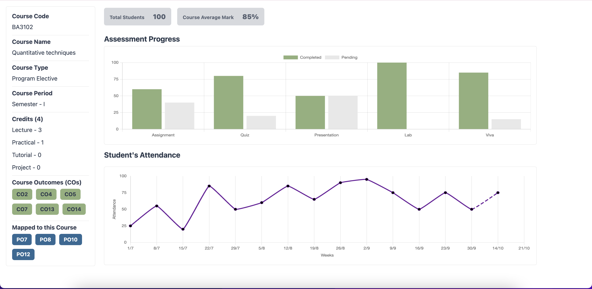

# Course Evaluation

This project was generated with [Angular CLI](https://github.com/angular/angular-cli) version 14.2.13.

## Overview

This Angular application displays course-related information, assessment progress, and student attendance using three main components: **Sidebar**, **Assessment Progress**, and **Student Attendance**, which are encapsulated within the **Course Evaluation** component.

## Features

- **Sidebar**: Navigates between different sections of the application.
- **Assessment Progress**: Visual representation of student assessment performance.
- **Student Attendance**: Displays attendance data and statistics.

## Libraries Used

- **Angular**: The primary framework for building the application.
- **Bootstrap**: For responsive design and layout.
- **Chart.js**: For rendering charts to visualize assessment progress and attendance data.

## Installation

To install the required libraries, run the following commands in your project directory:

```bash
npm install bootstrap
npm install chart.js
```

## Laptop view


## Mobile view


